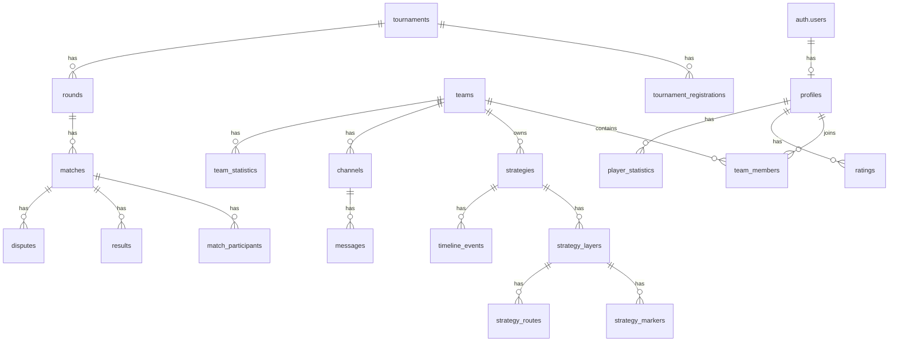
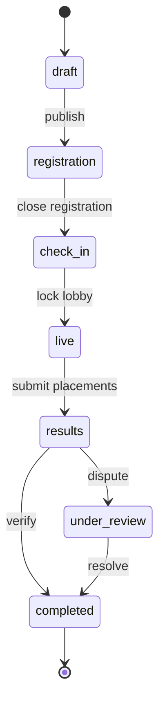
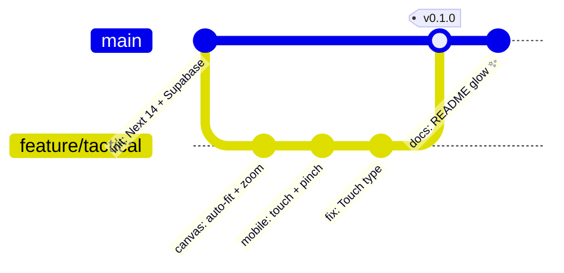
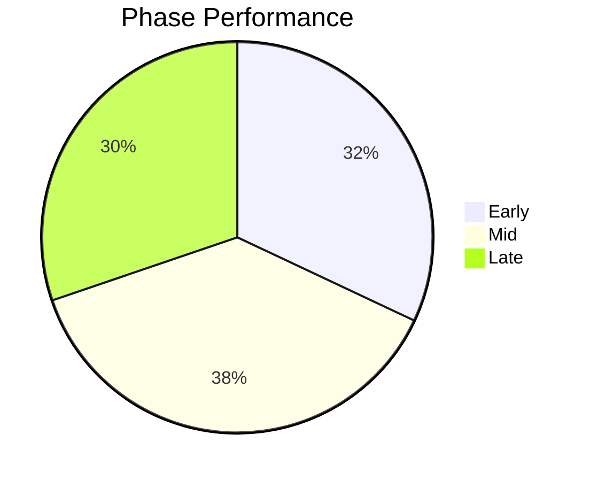
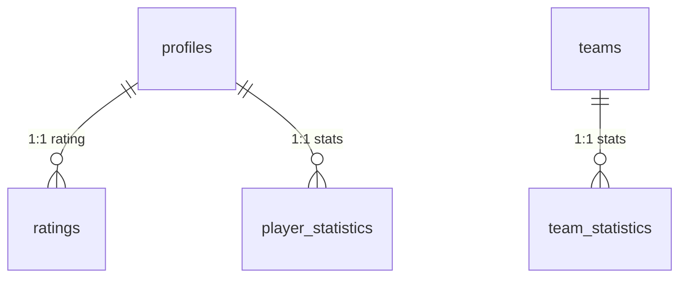
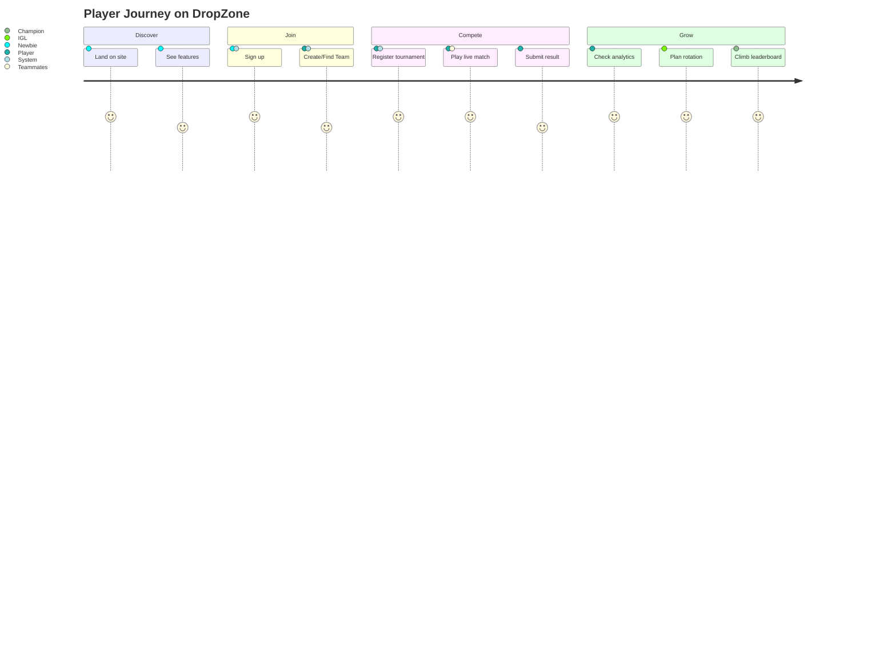

<div align="center">

<!-- capsule header -->


<!-- typing svg -->
<a href="https://git.io/typing-svg"></a>

<br/>

<!-- shields.io badges -->
<p>
  <a href="https://github.com/TarunIsOkay/high-profile-website"></a>
  <a href="https://github.com/TarunIsOkay/high-profile-website/network/members"></a>
  <a href="https://github.com/TarunIsOkay/high-profile-website/issues"></a>
  
  
  
</p>

<p>
  
  
  
  
  
  
</p>

> **Not affiliated with Garena.** Free Fire is a trademark of Garena International. Built for the community, by the community.

<p>
  <a href="#-quick-start"></a>
  <a href="#-live-demo"></a>
  <a href="https://github.com/TarunIsOkay/high-profile-website/issues/new?template=bug_report.md"></a>
  <a href="https://github.com/TarunIsOkay/high-profile-website/issues/new?template=feature_request.md"></a>
</p>

</div>

---

<!-- TOC -->
## 📑 Table of Contents

- [✨ Overview](#-overview)
- [🎯 Why DropZone?](#-why-dropzone)
- [🖼️ Preview](#️-preview)
- [🧱 Tech Stack](#-tech-stack)
- [🏗️ Architecture](#️-architecture)
- [⚡ Quick Start](#-quick-start)
- [🔐 Environment Variables](#-environment-variables)
- [📁 Project Structure](#-project-structure)
- [🔥 Features Deep Dive](#-features-deep-dive)
- [🗺️ Supported Maps](#️-supported-maps)
- [🗄️ Database Schema](#️-database-schema)
- [📊 Analytics & KPIs](#-analytics--kpis)
- [⌨️ Keyboard Shortcuts](#️-keyboard-shortcuts)
- [🚀 Deployment](#-deployment)
- [🛠️ Server Actions API](#️-server-actions-api)
- [🗺️ Roadmap](#️-roadmap)
- [🤝 Contributing](#-contributing)
- [🔒 Security & Moderation](#-security--moderation)
- [❓ FAQ](#-faq)
- [📈 Repo Stats](#-repo-stats)
- [📜 License & Credits](#-license--credits)

---

## ✨ Overview

<div align="center">

**DropZone** is the **premier competitive esports platform for Free Fire** — squad building, tournament engine, tactical map studio, realtime chat, and pro-grade analytics — all in one dark, fast, mobile-first experience.

`Next.js 14 (App Router)` + `Supabase (Postgres + Auth + Realtime)` + `Tailwind CSS` + `Framer Motion` + `Recharts`

</div>

> [!NOTE]
> DropZone runs 100% on the **App Router + Server Actions** — no REST boilerplate. Supabase handles Postgres, Auth, RLS, and Realtime in one shot.

> [!TIP]
> New here? Jump to [⚡ Quick Start](#-quick-start) and be live in **< 60 seconds**.

> [!IMPORTANT]
> Requires `Node.js >= 18.17` and a **Supabase project** (local or cloud). See [🔐 Environment Variables](#-environment-variables).

<table>
<tr>
<td align="center"><b>12.5K+</b><br/><sub>Active Players</sub></td>
<td align="center"><b>2,800+</b><br/><sub>Teams Formed</sub></td>
<td align="center"><b>450+</b><br/><sub>Tournaments Held</sub></td>
<td align="center"><b>28K+</b><br/><sub>Matches Played</sub></td>
</tr>
</table>

<!-- invisible comment: easter egg -->
<!-- DZ_SECRET: Try Konami code on the landing page 😉 -->

---

## 🎯 Why DropZone?

| Feature | DropZone | Discord + Sheets | Generic Tournament Tool |
| :--- | :---: | :---: | :---: |
| Find teammates (role/region/rating) | ✅ | ❌ | ⚠️ partial |
| Tournament engine (register → check-in → live → results) | ✅ | ❌ | ✅ |
| Tactical canvas (markers / routes / layers) | ✅ | ❌ | ❌ |
| Rotation planner + timeline | ✅ | ❌ | ❌ |
| Realtime chat (team + tournament channels) | ✅ | ✅ | ❌ |
| Analytics (K/D, WR, placement, rating) | ✅ | ❌ | ⚠️ basic |
| Anti-cheat / disputes / evidence | ✅ | ❌ | ⚠️ |
| Mobile pinch-zoom, bottom sheets | ✅ | — | ❌ |

> [!WARNING]
> If you’re still running tournaments on Google Sheets — you’re gifting hours to chaos. DropZone automates brackets, check-ins, room codes, and disputes.

---

## 🖼️ Preview

<div align="center">

<!-- picture with dark/light -->
<picture>
  <source media="(prefers-color-scheme: dark)" srcset="https://via.placeholder.com/1200x600/12121a/dc2626?text=DROPZONE+%E2%80%A2+DARK+MODE">
  <source media="(prefers-color-scheme: light)" srcset="https://via.placeholder.com/1200x600/ffffff/dc2626?text=DROPZONE+%E2%80%A2+LIGHT+MODE">
  
</picture>

*Hero — `src/app/landing/page.tsx:185` — radial glow + grid pattern + Framer entrance.*

| Dashboard | Map Studio | Analytics |
| :---: | :---: | :---: |
|  |  |  |
| Live matches • rating • community | Markers • Routes • Layers • Timeline | Recharts • Rating history • Leaderboard |

</div>

<details>
<summary><b>🎬 Landing Page Sections</b> — click to expand</summary>

- **Nav** — sticky blur, mobile drawer (`src/app/landing/page.tsx:92`)
- **Hero** — 3-line stacked headline with `.text-gradient` + `bg-hero-gradient`
- **Stats bar** — 4 KPIs bordered top/bottom
- **Features** — 6 cards (Find Squad, Compete, Master Map, Track, Stay Connected, Compete Fair)
- **Maps** — 6 Free Fire maps grid with hover scale + gradient overlay
- **CTA** — surface card with glow
- **Footer** — disclaimer + links

</details>

---

## 🧱 Tech Stack

<div align="center">


</div>

| Layer | Choice | Why |
| :--- | :--- | :--- |
| **Framework** | `Next.js 14 App Router` | RSC, Server Actions, `src/middleware.ts:1` auth guard |
| **DB + Auth + Realtime** | `Supabase` (`@supabase/ssr` `0.5.2`, `@supabase/supabase-js` `2.45.4`) | Postgres + RLS + Realtime channels (`src/lib/supabase/*`) |
| **Styling** | `Tailwind CSS` `3.4` + `tailwindcss-animate` + custom `dz` palette | Dark ops theme: `bg:#0a0a0f`, `crimson:#dc2626`, `cyan:#06b6d4` |
| **Motion** | `framer-motion` `11.11` | Page transitions, TacticalCanvas pan/zoom |
| **Charts** | `recharts` `2.13` | Rating history, match bars, pie phase |
| **Validation** | `zod` `3.23` | `src/validators/*` server action guards |
| **Icons** | `lucide-react` `0.453` | Consistent 16/20px ops icons |
| **Fonts** | `Inter` + `JetBrains Mono` | `src/app/globals.css:4` via Google Fonts |

<details>
<summary><b>🎨 Design Tokens</b> — <code>tailwind.config.ts:11</code></summary>

```ts
dz: {
  bg: "#0a0a0f", surface: "#12121a", elevated: "#1a1a26",
  border: "#2a2a3a", "border-light": "#3a3a4e",
  text: "#e8e8f0", "text-muted": "#8888a0", "text-dim": "#5a5a72",
  crimson: { DEFAULT: "#dc2626", 400: "#ff6b6b" },
  cyan: { DEFAULT: "#06b6d4", 400: "#22d3ee" },
  green: { DEFAULT: "#22c55e" }, amber: { DEFAULT: "#f59e0b" },
}
// shadows: glow, glow-lg, glow-cyan, card, elevated
// animations: pulse-glow, slide-up, slide-down, fade-in, shimmer
```

</details>

---

## 🏗️ Architecture

### High-Level Flow

```mermaid
flowchart LR
  A[👤 Player] --> B[Landing / Auth]
  B --> C{Middleware src/middleware.ts}
  C -->|anon| D[/landing, /auth/*]
  C -->|authed| E[(Dashboard Layout)]
  E --> F[[Tournaments]]
  E --> G[[Teams & Search]]
  E --> H[[Map Studio\nTacticalCanvas]]
  E --> I[[Analytics\nRecharts]]
  E --> J[[Realtime Chat\nSupabase Channels]]
  H --> K[(Supabase Postgres\nRLS + RLS Policies)]
  F --> K
  G --> K
  I --> K
  J --> K
  K --> L[Rating / Stats Triggers]
  style H fill:#dc2626,stroke:#fff,color:#fff
  style K fill:#3ECF8E,stroke:#000,color:#000
```

### Database ER (simplified)



### Tournament Lifecycle



### Git Graph (release line)



### Analytics Pie (phase perf demo)



---

## ⚡ Quick Start

> [!TIP]
> Prefer **Supabase Cloud**? Create a project at <https://supabase.com> → copy URL + anon key. Or run **locally** with `npx supabase start`.

### Prerequisites

| Requirement | Version | Check |
| :--- | :--- | :--- |
| Node.js | `>= 18.17` | `node -v` |
| npm | `>= 9` | `npm -v` |
| Supabase CLI (optional local) | latest | `npx supabase --version` |
| Git | any | `git --version` |

### 1️⃣ Clone & Install

```bash
git clone https://github.com/TarunIsOkay/high-profile-website.git
cd high-profile-website

npm install
# or: pnpm install / yarn / bun install
```

### 2️⃣ Environment

```bash
cp .env.local.example .env.local
# then edit .env.local with your Supabase creds
```

### 3️⃣ Database (pick one)

**Option A — Cloud (fastest):**
```bash
# 1. Paste schema manually in Supabase SQL Editor:
#    supabase/schema.sql  (660 lines, full RLS)
# 2. Or push via CLI:
npx supabase link --project-ref <YOUR_REF>
npx supabase db push
```

**Option B — Local:**
```bash
npx supabase start
npx supabase db reset   # applies supabase/schema.sql
```

### 4️⃣ Run

```bash
npm run dev        # http://localhost:3000  → redirects / → /landing
npm run build      # production build
npm run start      # serve build
npm run typecheck  # tsc --noEmit
npm run lint       # next lint
```

Press <kbd>Ctrl</kbd> + <kbd>C</kbd> to stop dev server.

<details>
<summary><b>🔧 Extra Scripts</b></summary>

```bash
npm run db:generate  # supabase gen types typescript --local > src/types/database.ts
npm run db:push      # supabase db push
npm run db:seed      # npx tsx supabase/seed.ts
```

</details>

<details>
<summary><b>🐳 Docker (optional)</b></summary>

```dockerfile
# Dockerfile (add if you need it)
FROM node:20-alpine
WORKDIR /app
COPY package*.json ./
RUN npm ci
COPY . .
RUN npm run build
EXPOSE 3000
CMD ["npm","start"]
```

</details>

---

## 🔐 Environment Variables

| Variable | Required | Example | Where |
| :--- | :---: | :--- | :--- |
| `NEXT_PUBLIC_SUPABASE_URL` | ✅ | `https://xyz.supabase.co` | Supabase → Project Settings → API |
| `NEXT_PUBLIC_SUPABASE_ANON_KEY` | ✅ | `eyJhbG...` | Same |
| `NEXT_PUBLIC_APP_URL` | ✅ | `http://localhost:3000` | Local / `https://your.vercel.app` prod |

```env
# .env.local
NEXT_PUBLIC_SUPABASE_URL=your-project-url
NEXT_PUBLIC_SUPABASE_ANON_KEY=your-anon-key
NEXT_PUBLIC_APP_URL=http://localhost:3000
```

> [!CAUTION]
> Never commit `.env.local`. `src/lib/supabase/server.ts` + `client.ts` will throw if vars are missing — see `src/middleware.ts:5` guard.

---

## 📁 Project Structure

```bash
.
├── public/
│   └── maps/                 # Bermuda, Kalahari, Purgatory, Alpine, Nextera, Solara .jpg
├── supabase/
│   └── schema.sql            # 660-line full schema + RLS + indexes
├── src/
│   ├── app/
│   │   ├── page.tsx              # → redirect /landing  (src/app/page.tsx:4)
│   │   ├── layout.tsx            # RootLayout + metadata
│   │   ├── globals.css           # Tailwind base + dz utilities + Inter / JetBrains Mono
│   │   ├── landing/page.tsx      # Marketing: hero, features, maps, CTA
│   │   ├── auth/{login,signup,callback,forgot-password}/
│   │   ├── (dashboard)/
│   │   │   ├── layout.tsx        # sidebar + topbar + mobile-nav
│   │   │   ├── dashboard/page.tsx  # rating, live matches, tournaments, activity
│   │   │   ├── tournaments/page.tsx
│   │   │   ├── teams/page.tsx
│   │   │   ├── strategies/page.tsx # Tactical editor (desktop + mobile)
│   │   │   ├── analytics/page.tsx  # Recharts + leaderboard
│   │   │   ├── chat/page.tsx       # Realtime channels
│   │   │   ├── search/page.tsx     # players/teams/tournaments/strategies
│   │   │   ├── profile/page.tsx
│   │   │   └── admin/page.tsx
│   │   └── actions/              # Server Actions (tournaments, teams, strategies, chat…)
│   ├── components/
│   │   ├── ui/  {button,card,badge,input,select,textarea,modal,avatar,skeleton}.tsx
│   │   ├── tactical/ {tactical-canvas.tsx, rotation-planner.tsx}
│   │   └── layout/ {sidebar.tsx, topbar.tsx, mobile-nav.tsx}
│   ├── lib/
│   │   ├── utils.ts              # cn() helper
│   │   └── supabase/{client.ts, server.ts}
│   ├── hooks/index.ts
│   ├── types/index.ts            # User, Profile, Team, Tournament, Match, Strategy…  (src/types/index.ts:1)
│   ├── validators/               # zod schemas
│   └── middleware.ts             # Supabase auth guard + env check
├── tailwind.config.ts            # dz palette, grid-pattern, hero-gradient, animations
├── next.config.mjs               # remotePatterns: **.supabase.co
└── tsconfig.json
```

> [!NOTE]
> `src/components/tactical/tactical-canvas.tsx:62` is a full `<canvas>` engine: pan, zoom, pinch, drag, route draw. `src/app/(dashboard)/strategies/page.tsx:149` has **desktop + mobile** layouts with bottom sheets.

---

## 🔥 Features Deep Dive

<details open>
<summary><b>🏆 1. Tournament Engine</b> — <code>src/app/(dashboard)/tournaments/page.tsx:31</code></summary>

- **Statuses:** `draft` → `registration` → `check-in` → `live` → `results` → `completed` (with `under-review`/`disputed` for matches)
- **Fields:** `max_teams` (default 50), `min/max_team_size` (4), `prize_pool`, `entry_fee`, `registration_opens/closes`, `check_in_opens`, `starts_at`, `rules`
- **UI:** filter pills, live `dot` badge, `Register` / `Check In` / `Watch` CTAs, `Create Tournament` modal (`game: free-fire`, `format: br-squad/duo/solo`)
- **Tables:** `tournaments`, `tournament_registrations`, `rounds`, `matches`, `match_participants`, `results`, `disputes`

```ts
// src/types/index.ts:17
type TournamentStatus = "draft" | "registration" | "check-in" | "live" | "results" | "completed"
type MatchStatus = "upcoming" | "check-in" | "room-ready" | "live" | "result-submission" | "under-review" | "completed" | "disputed"
```

</details>

<details>
<summary><b>👥 2. Teams & Player Discovery</b> — <code>src/app/(dashboard)/teams/page.tsx:31</code> + <code>search/page.tsx:34</code></summary>

- **Team card:** tag badge, region, `is_recruiting`, member count (`team_members(count)`), wins
- **Create Team:** name, tag (2–5 chars), description, region (7: `asia|eu|na|sa|me|oce|africa`) + country, `created_by` + auto `team_members` as `owner`
- **Player:** `primary_role` ∈ `igl|rusher|support|sniper|flanker|all-rounder`, `status` ∈ `online|offline|in-match|looking-for-team`, `looking_for_team`, socials (discord/youtube/twitch/twitter/instagram)
- **Search tabs:** Players / Teams / Tournaments / Strategies with debounced `ilike` + `limit 20` + realtime `visibility='public'` filter

</details>

<details>
<summary><b>🗺️ 3. Tactical Map Studio — Canvas Engine</b> — <code>src/components/tactical/tactical-canvas.tsx:47</code></summary>

- **Maps:** 6 — Bermuda, Kalahari, Purgatory, Alpine, Nextera, Solara (`/public/maps/*.jpg`)
- **Tools:** `Select` (drag), `Marker` (player/enemy/loot/objective/danger/custom), `Route` (polyline + arrowhead)
- **Layers:** Players / Enemies / Routes / Zones — `visible` + `locked` + `order`
- **Interactions:**
  - Desktop: scroll zoom, <kbd>Alt</kbd> + drag pan, <kbd>+</kbd>/<kbd>-</kbd>/<kbd>0</kbd> fit, drag markers, `Delete` to remove
  - Mobile: pinch-zoom, single-finger pan, tap to place, bottom toolbar + sheets (`colors|roles|layers|markers`)
- **Persistence:** `saveMarkers()` + `saveRoutes()` → `strategy_markers` / `strategy_routes` via Server Actions (`src/app/actions/strategies.ts`)

```tsx
// markers carry color + role, routes carry animated dashed lines
type Marker = { id:string; type:"player"|"enemy"|"loot"|..., x:number; y:number; label?:string; color:string; role?:string }
type Route  = { id:string; points:{x:number;y:number}[]; color:string; animated:boolean }
```

</details>

<details>
<summary><b>⏱️ 4. Rotation Planner</b> — <code>src/components/tactical/rotation-planner.tsx</code></summary>

- **Timeline events:** `phase`, `label`, `time_seconds`, `duration_seconds`, `order` (`timeline_events` table)
- **Controls:** Play / Pause / Reset, integrated above/bottom of canvas, synced with `activeColor`/`activeRole`

</details>

<details>
<summary><b>💬 5. Realtime Chat</b> — <code>src/app/(dashboard)/chat/page.tsx:16</code></summary>

- **Channels:** `general`, `announcements`, `match-discussion`, etc. — `channels` table (`tournament_id` / `team_id` scoped, `is_private`)
- **Realtime:** `supabase.channel('chat:'+id).on('postgres_changes', {table:'messages'})` + `messagesEndRef` auto-scroll
- **Message:** `content`, `reply_to`, `edited`, `created_at`, optimistic append + `sendMessage()` Server Action
- **UI:** channel list + unread badges, header with `Hash`, input bar with `@` + `Smile` + `Send`, fallbacks when RLS empty

</details>

<details>
<summary><b>📊 6. Analytics & Leaderboard</b> — <code>src/app/(dashboard)/analytics/page.tsx:28</code></summary>

- **Stat cards:** Total Matches, Win Rate, K/D, Rating (from `player_statistics` + `ratings`)
- **Charts:** Area `Rating History` (gradient `colorRating`), Bar `Recent Matches` (placement vs eliminations), `Map Performance` bars, Pie `Phase Performance`
- **Leaderboard:** `ratings` joined `profiles` — `global_rank` / `regional_rank` / `country_rank`, top 20, gold/silver/bronze tint
- **KPI formulas:**

$$
\text{WinRate} = \frac{\text{wins}}{\text{total\_matches}} \quad
\text{KDR} = \frac{\text{eliminations}}{\text{deaths}} \quad
\text{BooyahRate} = \frac{\text{booyahs}}{\text{total\_matches}}
$$

</details>

<details>
<summary><b>🔍 7. Dashboard</b> — <code>src/app/(dashboard)/dashboard/page.tsx:18</code></summary>

- **Quick stats:** Your Rating (with `Rank #`), Live Matches count, Tournaments, Community
- **Live Matches:** `matches` where `status='live'` + `tournaments(name)` join, pulsing dot
- **Community:** recent `profiles` by `updated_at`
- **Upcoming Tournaments:** filtered `status ∈ [registration, check-in, live]`, `max_teams`, `prize_pool`, `starts_at`

</details>

<details>
<summary><b>🛡️ 8. Auth, RLS & Moderation</b> — <code>supabase/schema.sql:449</code></summary>

- **Auth:** Supabase `auth.users` + `profiles` (`user_id` FK), `src/middleware.ts` refreshes session cookies
- **RLS (enabled on 17 tables):**
  - `profiles` — public read, owner write
  - `teams` — public read, `authenticated` create, `owner|captain` update
  - `strategies` — `visibility` gated: `public` / `author` / `team` members
  - `messages` — channel members only (private team channels restricted)
  - `notifications` — owner only, system can insert
  - `reports` — reporter + admin, `status: pending|reviewed|resolved|dismissed`
  - `audit_logs` — admin only
- **Reports:** `target_type: user|team|message|tournament|strategy`, `reason: cheating|toxicity|griefing|impersonation|inappropriate-content|other`

</details>

---

## 🗺️ Supported Maps

| Map | File | Use |
| :--- | :--- | :--- |
| **Bermuda** | `/maps/bermuda.jpg` | Classic BR — rotation & zone study |
| **Kalahari** | `/maps/kalahari.jpg` | Desert — high ground holds |
| **Purgatory** | `/maps/purgatory.jpg` | Compact — rush routes |
| **Alpine** | `/maps/alpine.jpg` | Snow — sniper lanes |
| **Nextera** | `/maps/nextera.jpg` | Futuristic — verticality |
| **Solara** | `/maps/solara.jpg` | Newest — portal plays |

> Drop your own: add `public/maps/<name>.jpg` + extend `maps[]` in `src/app/(dashboard)/strategies/page.tsx:41`.

---

## 🗄️ Database Schema

<details>
<summary><b>📜 Full <code>supabase/schema.sql</code> — 9 enums + 22 tables + 25 indexes + 20+ RLS policies</b></summary>

```sql
-- Enums
create type user_role as enum ('user','admin','moderator');
create type region as enum ('asia','eu','na','sa','me','oce','africa');
create type game_role as enum ('igl','rusher','support','sniper','flanker','all-rounder');
create type team_role as enum ('owner','captain','member','substitute');
create type player_status as enum ('online','offline','in-match','looking-for-team');
create type tournament_status as enum ('draft','registration','check-in','live','results','completed');
create type match_status as enum ('upcoming','check-in','room-ready','live','result-submission','under-review','completed','disputed');
create type strategy_visibility as enum ('private','team','shared','public');

-- Core tables (excerpt)
create table profiles ( id uuid primary key, user_id uuid references auth.users, username text unique, ... );
create table teams ( id uuid primary key, name text, tag text, region region, is_recruiting bool, ... );
create table tournaments ( id uuid primary key, name text, status tournament_status, max_teams int, ... );
create table matches ( id uuid primary key, tournament_id uuid, round_number int, map text, status match_status, room_id text, ... );
create table strategies ( id uuid primary key, name text, map text, author_id uuid, visibility strategy_visibility, ... );
create table strategy_markers ( id uuid primary key, strategy_id uuid, x numeric, y numeric, color text, role game_role, ... );
create table ratings ( user_id uuid primary key, rating numeric default 1000, global_rank int, ... );
```

See full: [`supabase/schema.sql`](supabase/schema.sql) — `src/types/index.ts:45` mirrors it 1:1.

</details>



**Key indexes:** `profiles(username, region, status)`, `tournaments(status, starts_at)`, `matches(status)`, `strategies(map, visibility)`, `ratings(rating DESC)` — `supabase/schema.sql:368`.

---

## 📊 Analytics & KPIs

$$
\begin{aligned}
\text{Average Placement} &= \frac{\sum \text{placement}}{n} \\
\text{Headshot Rate} &= \frac{\text{headshots}}{\text{hits}} \times 100 \\
\Delta \text{Rating} &= f(\text{placement}, \text{elims}, \text{lobby strength})
\end{aligned}
$$

| Metric | Source Table | UI |
| :--- | :--- | :--- |
| Total Matches, Wins, Booyahs, Elims, Damage | `player_statistics` | `analytics/page.tsx:42` |
| K/D, Win Rate, Booyah Rate, Headshot Rate, Avg Placement | computed | stat cards |
| Rating + Global/Regional/Country Rank | `ratings` | leaderboard + dashboard |
| Map Win% (`wins/matches`) | demo `demoMapStats` / future `team_statistics` | `Map Performance` bars |
| Phase score (Early/Mid/Late) | `timeline_events` aggregates | Pie chart |

> Leaderboard query: `ratings` ordered `rating DESC limit 20` joined `profiles(username, display_name, region, primary_role)` — `src/app/(dashboard)/analytics/page.tsx:45`.

---

## ⌨️ Keyboard Shortcuts

| Shortcut | Context | Action |
| :--- | :--- | :--- |
| <kbd>Scroll</kbd> | Canvas | Zoom in/out (`tactical-canvas.tsx:219`) |
| <kbd>Alt</kbd> + <kbd>Drag</kbd> / <kbd>MMB</kbd> | Canvas | Pan (`handleCanvasMouseDown`) |
| <kbd>+</kbd> / <kbd>=</kbd> | Canvas focused | Zoom in |
| <kbd>-</kbd> | Canvas focused | Zoom out |
| <kbd>0</kbd> | Canvas focused | Fit to container (`fitToContainer`) |
| <kbd>Delete</kbd> / <kbd>Backspace</kbd> | Marker selected | Delete marker |
| <kbd>Enter</kbd> | Chat input | Send message |
| <kbd>Ctrl</kbd> + <kbd>K</kbd> | Search | Focus search (browser) |
| <kbd>Esc</kbd> | Modal / Sheet | Close |

Mobile: **pinch to zoom**, **drag to pan**, **tap to place** — `src/components/tactical/tactical-canvas.tsx:284`.

---

## 🚀 Deployment

### Vercel (recommended)

```bash
# 1. Push to GitHub
git push origin main

# 2. Import in Vercel → set env vars:
#    NEXT_PUBLIC_SUPABASE_URL
#    NEXT_PUBLIC_SUPABASE_ANON_KEY
#    NEXT_PUBLIC_APP_URL=https://your-app.vercel.app

# 3. Deploy — Next.js auto-detected
```

`next.config.mjs:4` already allows `**.supabase.co` images.

### Supabase

- Cloud: paste `supabase/schema.sql` in SQL Editor → enable **Realtime** for `messages` + `matches`.
- Local: `npx supabase start` + `npx supabase db reset`.

### Checks before deploy

```diff
+ npm run typecheck   # must be clean
+ npm run lint
+ npm run build       # must be green
- missing env vars → middleware crash (fixed in 927fc99)
```

---

## 🛠️ Server Actions API

| File | Export | Purpose |
| :--- | :--- | :--- |
| `src/app/actions/tournaments.ts` | `createTournament()` | inserts `tournaments` + audit |
| `src/app/actions/teams.ts` | `createTeam()` | inserts `teams` + `team_members(owner)` |
| `src/app/actions/strategies.ts` | `createStrategy()`, `updateStrategy()`, `saveMarkers()`, `saveRoutes()` | CRUD `strategies*` |
| `src/app/actions/chat.ts` | `getChannels()`, `getMessages()`, `sendMessage()` | `channels` + `messages` (RLS) |
| `src/app/actions/profiles.ts` | `updateProfile()` | `profiles` upsert |
| `src/app/actions/admin.ts` | `*` | `reports`, `audit_logs` (admin only) |

All actions validate with `zod` + check `auth.uid()` + respect RLS — no service_role leak.

---

## 🗺️ Roadmap

- [x] Landing + Auth (login/signup/callback/forgot)
- [x] Dashboard (rating, live matches, community)
- [x] Teams (create/search/recruiting)
- [x] Tournaments (register/check-in/live)
- [x] Tactical canvas (markers/routes/layers + auto-fit + pinch)
- [x] Rotation planner + timeline
- [x] Chat (channels + realtime + fallback)
- [x] Search (players/teams/tournaments/strategies)
- [x] Analytics (Recharts + leaderboard)
- [ ] Bracket visualization (single/double elim)
- [ ] Room code auto-expire + copy-to-clipboard
- [ ] Evidence upload (Supabase Storage) for `results.evidence_url`
- [ ] Push notifications (via `notifications` table + Realtime)
- [ ] PWA + offline canvas
- [ ] i18n (EN/HI + regional)
- [ ] Admin panel: disputes, reports, audit logs UI

> [!TIP]
> Want to claim a roadmap item? Open an issue with `roadmap` label — first PR gets a **shoutout in README**!

---

## 🤝 Contributing

We love PRs — from typo fixes to canvas perf!

```bash
# 1. Fork → clone your fork
git clone https://github.com/<YOU>/high-profile-website.git

# 2. Branch
git checkout -b feat/your-feature

# 3. Code + test
npm run typecheck && npm run build

# 4. Commit (conventional)
git commit -m "feat: add bracket view"

# 5. Push + PR
git push origin feat/your-feature
```

<details>
<summary><b>📝 Contribution Rules</b></summary>

- Follow `eslint-config-next` + `prettier` (if added).
- Keep `src/types/index.ts` in sync with `supabase/schema.sql`.
- Add RLS policies for any new table — **no public write**.
- Mobile first: test `strategies` page at `375px` and `1024px`.
- Add a short Loom / GIF for UI PRs.

</details>

<details>
<summary><b>🐛 Bug Report Template</b></summary>

```md
**Describe the bug**
**To Reproduce** steps
**Expected behavior**
**Screenshots / Recording**
**Env:** OS, browser, Node version
```

</details>

> [!NOTE]
> By contributing you agree that your contributions are licensed under **MIT**.

---

## 🔒 Security & Moderation

| Concern | Handling |
| :--- | :--- |
| **Auth** | Supabase Auth (email + OAuth ready), `middleware.ts` guards `(dashboard)/*` |
| **RLS** | 20+ policies — least privilege (`supabase/schema.sql:449`) |
| **Reports** | `reports` table: `cheating|toxicity|griefing|impersonation|inappropriate-content|other` — `pending→reviewed→resolved|dismissed` |
| **Disputes** | `disputes` per `match_id` with `evidence_url` + `resolved_by` |
| **Audit** | `audit_logs` (`user_id, action, entity_type, details, ip_address`) — admin only |
| **Secrets** | `.env.local` gitignored; `env` checked at boot |

> [!CAUTION]
> Never expose `SUPABASE_SERVICE_ROLE_KEY` to the client. Only `NEXT_PUBLIC_*` anon keys are browser-safe.

Found a vulnerability? Email **security@dropzone.gg** (or open a **private** advisory) — we’ll respond within 48h.

---

## ❓ FAQ

<details>
<summary><b>Is this only for Free Fire?</b></summary>

Default `game='free-fire'` + `format='battle-royale'` but schema is generic — add `valorant|bgmi|codm` as `game` values, update `src/app/actions/tournaments.ts` enum, and you’re cross-title.

</details>

<details>
<summary><b>Can I self-host without Vercel?</b></summary>

Yes — `npm run build && npm start` works anywhere Node runs (Docker, Railway, Fly, Render). Only Supabase URL + anon key are required.

</details>

<details>
<summary><b>Why Supabase and not Firebase?</b></summary>

Postgres + RLS + Realtime + Storage + Auth in one SQL-ergonomic box. No vendor NoSQL lock-in, trivial `supabase/schema.sql` portability, and `join`s for leaderboard/analytics.

</details>

<details>
<summary><b>How do I add a new map?</b></summary>

1. Add `public/maps/mymap.jpg` (2048+ px recommended)
2. Extend `maps[]` in `src/app/(dashboard)/strategies/page.tsx:41` and `src/app/landing/page.tsx:77`
3. Insert `strategies` with `map='mymap'` — canvas auto-fits via `fitToContainer()`.

</details>

<details>
<summary><b>Do I need Supabase local?</b></summary>

No — Supabase Cloud works. Local (`npx supabase start`) is faster for schema iteration + type gen (`db:generate`).

</details>

---

## 📈 Repo Stats

<div align="center">


<br/>


<br/>


</div>



---

## 📜 License & Credits

**MIT** © 2026 DropZone — see [LICENSE](LICENSE) if present.

**Credits**

- **Framework:** [Next.js](https://nextjs.org) • **DB/Auth:** [Supabase](https://supabase.com) • **Styling:** [Tailwind CSS](https://tailwindcss.com)
- **Icons:** [Lucide](https://lucide.dev) • **Motion:** [Framer Motion](https://www.framer.com/motion) • **Charts:** [Recharts](https://recharts.org)
- **Fonts:** [Inter](https://fonts.google.com/specimen/Inter) + [JetBrains Mono](https://fonts.google.com/specimen/JetBrains+Mono)
- **Maps & inspiration:** Garena Free Fire community — this project is **not affiliated** with Garena.

> [!IMPORTANT]
> If you use DropZone in production, please **star ⭐ the repo** — it helps the community discover us!

---

<div align="center">

### Built with ❤️ for the grind — from scrim to BOOYAH!

<sub>DropZone • <code>src/app/landing/page.tsx:195</code> “BUILD YOUR SQUAD. MASTER THE MAP. DOMINATE THE COMPETITION.”</sub>

<br/>

<a href="https://github.com/TarunIsOkay/high-profile-website#top">⬆ Back to top</a> • <a href="https://github.com/TarunIsOkay/high-profile-website/issues">🐛 Issues</a> • <a href="https://github.com/TarunIsOkay/high-profile-website/discussions">💬 Discussions</a>

<br/><br/>


<br/>

<sup>Footnotes</sup>

[^1]: All KPIs are derived from `player_statistics`, `team_statistics`, and `ratings`. RLS ensures users only mutate their own rows.
[^2]: Capsule, typing SVG, streak, and hit counter are **GitHub README-only** render tricks — they work on GitHub, not npm.

<!-- reference links -->
[demo]: https://high-profile-website.vercel.app
[supabase]: https://supabase.com
[vercel]: https://vercel.com

</div>

<!-- secret feature: reference-style links, footnotes, math, mermaid, alerts, details, picture, kbd, sub/sup, abbr, task lists, diff, html comments, capsule, typing svg, shields, hits, stats cards, streak -->
